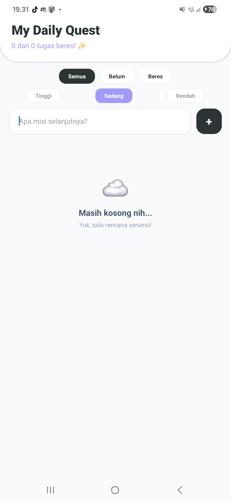
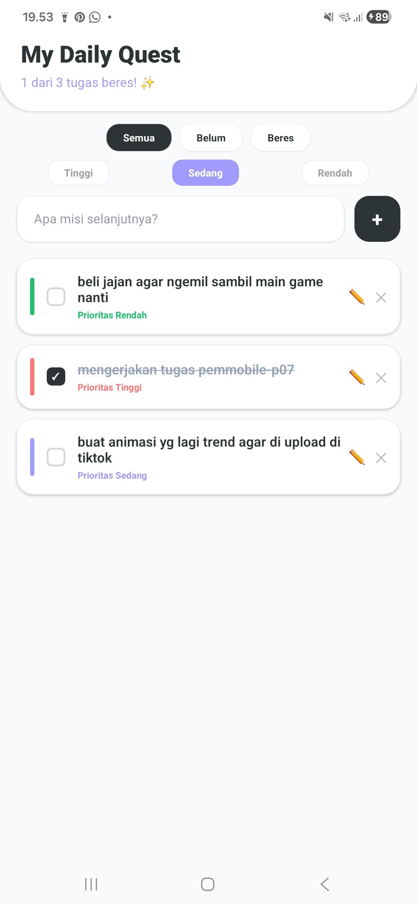
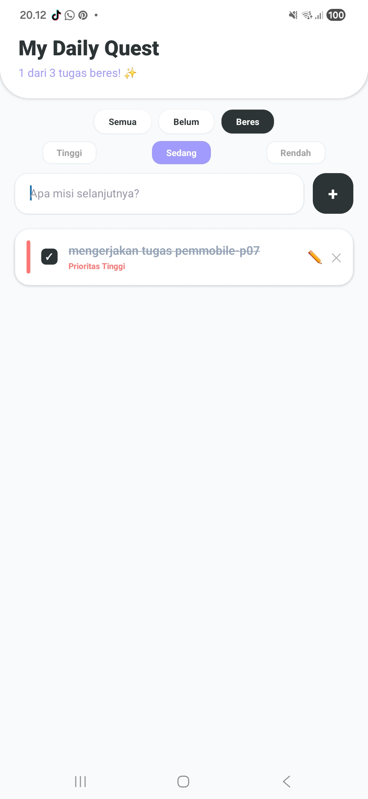
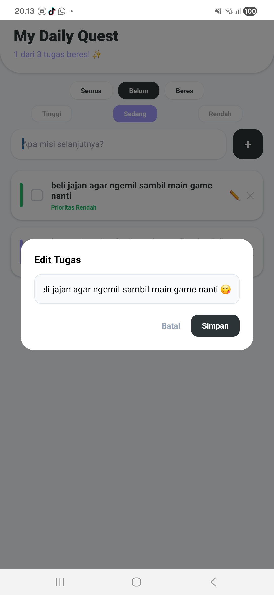

# MyTaskList App - Pemrograman Mobile Pertemuan 7

Aplikasi "My Daily Quest" adalah task manager sederhana yang dirancang untuk membantu pengguna mengelola daftar tugas harian dengan sistem prioritas yang terorganisir. Aplikasi ini mengintegrasikan seluruh materi dasar React Native dari Pertemuan 1 hingga 6, mulai dari state management hingga list dinamis yang responsif.

## Nama & NIM
- **Nama:** Trisa Deanna Viona Siregar
- **NIM:** 243303621264

## Deskripsi Aplikasi
Aplikasi ini merupakan "Mini Project Integrasi" yang mewujudkan manajemen tugas harian dengan fitur cerdas. Pengguna dapat menambah tugas, menentukan prioritas (Tinggi/Sedang/Rendah), serta memantau progres tugas melalui fitur filter dan task counter secara real-time.

## Fitur yang Diimplementasikan

### ✅ Requirement Wajib (Poin 100)
- [x] **Setup & Running di HP Fisik** — Project dibuat dengan `npx create-expo-app` dan dijalankan via Expo Go (bukti screenshot terlampir).
- [x] **Komponen Dasar (P02 & P03)** — Menggunakan `View`, `Text`, `TouchableOpacity`, dan layout penuh dengan `StyleSheet.create`.
- [x] **State Management (P04)** — Implementasi `useState` untuk input teks, array data task, dan *conditional rendering* pada status tugas.
- [x] **Form Input dengan Validasi (P05)** — Menggunakan `TextInput` dan `KeyboardAvoidingView` dengan validasi agar tidak submit data kosong.
- [x] **List Dinamis dengan FlatList (P06)** — Menampilkan data dengan `keyExtractor` unik dan fitur `ListEmptyComponent` untuk empty state.
- [x] **Fitur CRUD Dasar** — Mendukung operasi Tambah (Add) dan Hapus (Delete) tugas.

### ⭐ Fitur Bonus (Poin Tambahan)
- [x] Mark as Done (+5) — Fitur untuk mencentang dan mencoret tugas yang telah selesai.
- [x] Prioritas Task (+5) — Warna indikator berbeda untuk tiap tingkat urgensi: Tinggi (Merah), Sedang (Ungu), dan Rendah (Hijau).
- [x] Task Counter (+5) — Menampilkan status "X dari Y tugas beres" secara real-time di header.
- [x] Filter View (+5) — Memisahkan tampilan berdasarkan status Semua, Belum, atau Beres.
- [x] Deploy ke Expo Snack (+10) — Project dapat diakses dan dijalankan secara publik melalui link Expo Snack.
- [x] UI Profesional & Konsisten (+10) — Desain antarmuka yang rapi, menggunakan kartu yang modern, dan layout yang intuitif.
- [x] **Fitur Edit Tugas** — Kemampuan untuk memperbarui isi teks tugas yang sudah ada melalui Modal.

## Screenshot (Running on Physical Device)

  <table border="0">
    <tr>
      <td align="center">
        <b>1. Empty State (P06)</b> 
        <i>Tampilan awal aplikasi</i> 
        
      </td>
      <td align="center">
        <b>2. Dashboard & Prioritas</b> 
        <i>Bonus: Prioritas & Counter</i> 
        
      </td>
    </tr>
    <tr>
      <td align="center">
        <b>3. Filter Beres (Bonus)</b> 
        <i>Filter tugas & Mark as Done</i> 
        
      </td>
      <td align="center">
        <b>4. Edit Modal</b> 
        <i>Manajemen edit tugas harian</i> 
        
      </td>
    </tr>
  </table>

## Cara Menjalankan
1. **Clone repositori**: git clone [https://github.com/tris-aja/MyTaskList-App.git](https://github.com/tris-aja/MyTaskList-App.git)
2. **cd MyTaskList-App**: cd MyTaskList-App
3. **Install dependensi**: npm install
4. **Jalankan project**: npx expo start
5. **Scan QR Code menggunakan aplikasi Expo Go di HP fisik Anda.**

## 🔗 Demo
[Cek di Expo Snack](https://snack.expo.dev/@tris_aja/mytasklist-app)